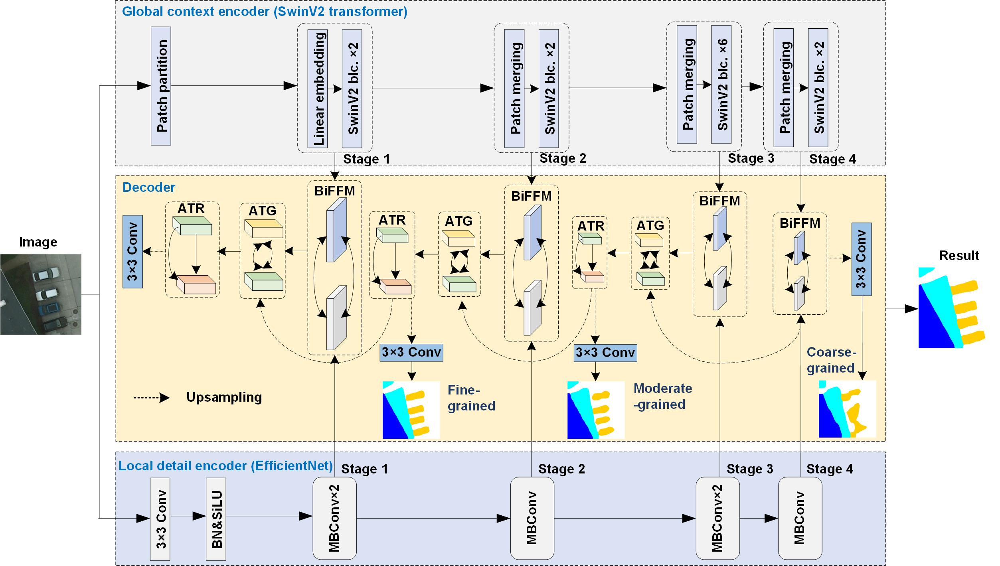
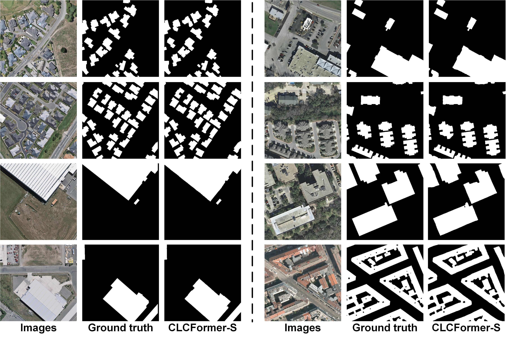

# CLCFormer

Official Pytorch Code base for [Integrating spatial details with long-range contexts for semantic segmentation of very high resolution remote sensing images]

[Project](https://github.com/long123524/CLCFormer)

## Introduction

This paper presents a cross-learning network (i.e., CLCFormer) integrating fine-grained spatial details within long-range global contexts based upon convolutional neural network (CNN) and transformer, for semantic segmentation of very high-resolution (VHR) remote sensing images. 

<p align="center">
  
</p>

<p align="center">
  
</p>

## Using the code:

The code is stable while using Python 3.7.0, CUDA >=11.0

- Clone this repository:
```bash
git clone https://github.com/long123524/CLCFormer
cd CLCFormer
```

To install all the dependencies using conda or pip:

```
PyTorch
timm
OpenCV
numpy
tqdm
PIL
```

## Datasets

Inria building dataset:https://project.inria.fr/aerialimagelabeling/   
WHU building dataset:http://gpcv.whu.edu.cn/data/building_dataset.html
Potsdam dataset:https://www.isprs.org/education/benchmarks/UrbanSemLab/Default.aspx

## Pretrained weight
Efficientnet & SwinV2: 链接：https://pan.baidu.com/s/1zBmHtnpafVjstgdLUO7DJA 提取码：qv8z 
link: https://drive.google.com/file/d/1arfOBeQWZLUStvc64MkgtG3nQesG2Ini/view?usp=sharing

## Training and testing
1. Train the model
python train_isic.py

2. Evaluate 
python accuracy_evaluation.py (binary classfication, e.g., building extracting) or python accuracy_multi_class.py (multi-class classification)

## Acknowledgement
We are very grateful for these excellent works [ST-UNet](https://github.com/XinnHe/ST-UNet), [TransFuse](https://github.com/Rayicer/TransFuse) and [BuildFormer](https://github.com/WangLibo1995/BuildFormer), which have provided the basis for our framework.

### Citation:
```
Citation：
{
Authors: Long Jiang （龙江）, Li Mengmeng* （李蒙蒙）, Wang Xiaoqin （汪小钦）;
Institute: The Academy of Digital China (Fujian), Fuzhou University,
Article Title: Integrating spatial details with long-range contexts for semantic segmentation of very high resolution remote sensing images,
Publication title: IEEE Geoscience and Remote Sensing Letters,
Year: 2023,
volume： 20
Page:1-5,
DOI: 10.1109/LGRS.2023.3262586
}
```
